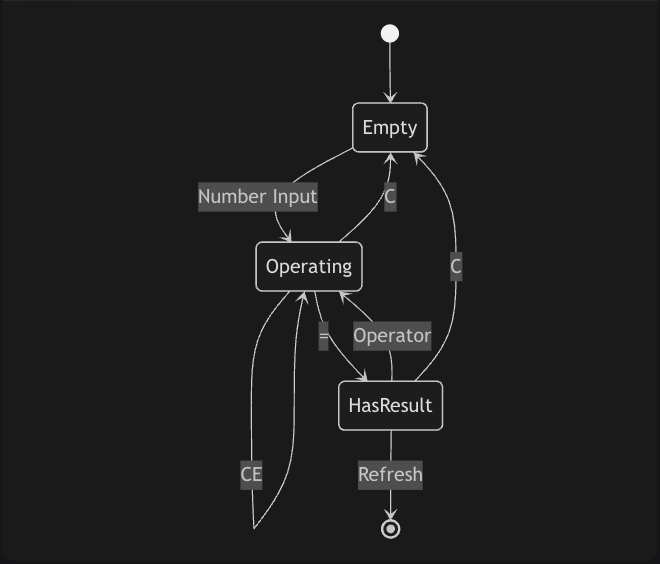
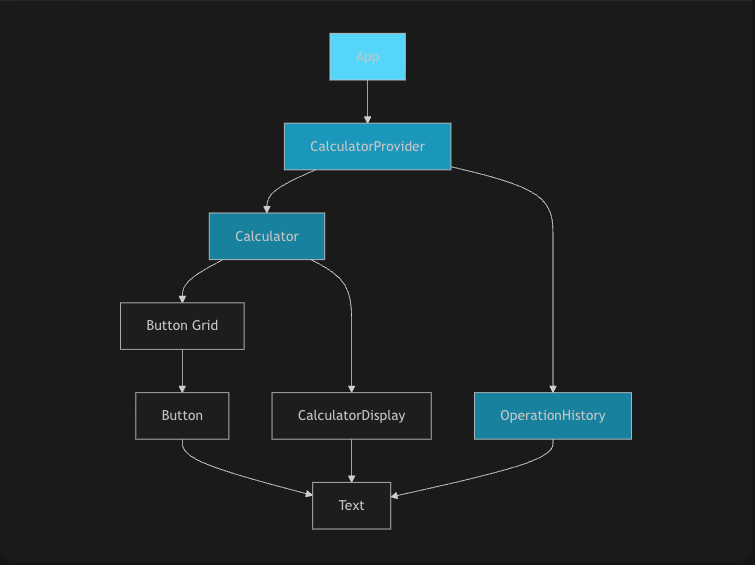
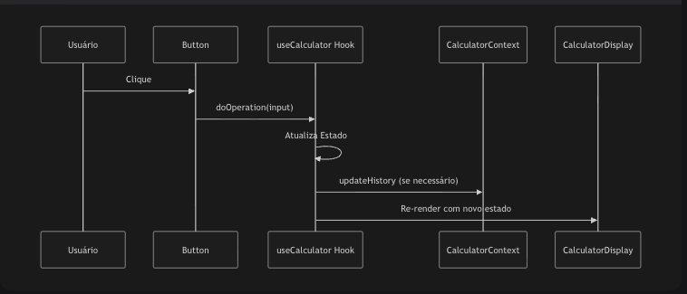
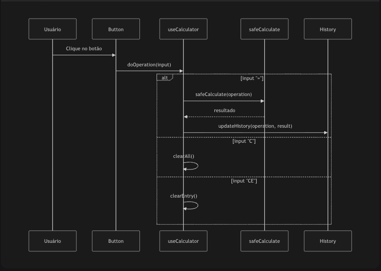

# 🧮 Calculadora React

Uma calculadora moderna e responsiva desenvolvida em React com Tailwind CSS, oferecendo interface intuitiva e funcionalidades avançadas.

## ✨ Funcionalidades

- ➕ **Operações Básicas**: Adição, subtração, multiplicação e divisão
- 🔢 **Sistema Decimal**: Suporte a números decimais (vírgula)
- 📱 **Design Responsivo**: Adaptável para desktop e mobile
- 🎨 **Interface Moderna**: Design glassmorphism com gradientes
- 📊 **Histórico em Tempo Real**: Visualização das operações realizadas
- 🧹 **Controles de Limpeza**: CE (Clear Entry) e C (Clear All)
- 🔒 **Cálculo Seguro**: Implementação segura sem uso de eval()
- ♿ **Acessível**: Navegação por teclado e ARIA labels

## 🏗️ Arquitetura do Projeto
calculadora-react/  
├── index.html # Página principal  
├── README.md # Documentação  
└── assets/  
└── diagrams/ # Diagramas da arquitetura  

## 🔧 Tecnologias Utilizadas
React 18 - Biblioteca UI

Tailwind CSS - Framework CSS

Babel - Transpilação JSX

Google Fonts - Tipografia (Rubik)

Desenvolvido com ❤️ usando React e Tailwind CSS

## 📊 Diagramas Adicionais   

### Diagrama de Estado

### Diagrama de Component Hierarchy

### Fluxo de Dados

### Fluxo de Operações

